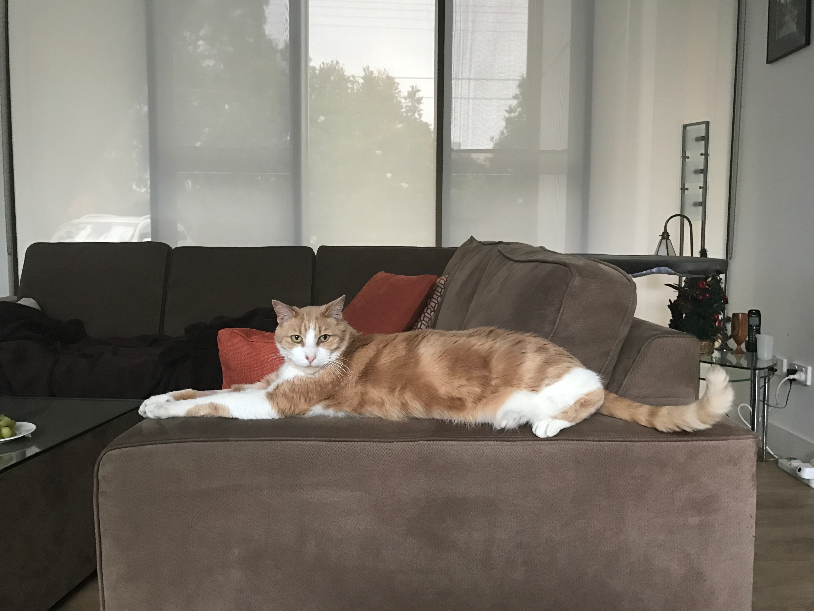

Ruby passed away on 15th February 2017 at about 1:10PM. He was about 10 years old.

He arrived on our front door about 6 months after we moved in (2008) and stayed. We found his original owners but he wasn't impressed when they called to collect him and he decided he wanted to stay. Ruby usually got his way.

Initially he was supposed to be the downstairs cat at night with Java staying on our bed. That didn't last long. He'd scratch the carpet at our bedroom door, frighten Java and keep us awake. He soon got his way with that too.

He'd hop up on our bed and grab a little blanket between his teeth and proceed to hump one of our legs (usually mine). That would last 5-10 minutes. We always thought it really weird but accepted it as one of Ruby's quirks. He'd then jump off and find another place to lie for the night.

Occasionally he'd jump up onto the bed during the night and curl up in a ball between us...or be a pain in the ass and lie directly on one side of the bed or the other. You wouldn't know it till you turned over in the middle of the night and felt the weight between your legs. Many nights of awkward sleeping with careful leg movements were had.

On Saturday mornings he'd start playing with cables (iPhone/iPad chargers) at the side of the bed to encourage us to get up. Eileen would throw something at him and he'd run at full speed up the hallway, thereby creating more noise. He'd eventually win the battle of sleep over food. I'd often wonder why there was a pair of women's knickers on my side of the bed.

He would drink from a running tap in the bathroom and when we weren't around to run the tap, from a glass we left on the bathroom locker. You'd hear him lapping at the water in the middle of the night sometimes. For some reason he'd always need encouragement to jump up onto the bathroom locker. It was only a 3 ft jump but he'd always hesitate. I remember when he was drinking you'd see his main teeth protruding down the side of his gums. They were long and sharp.

He loved company and would do anything to stay in the same room as me or Eileen. He'd often come into the bathroom when I was having a shower just to keep me company.

Play time consisted of him hiding under things, having you poke your hand in and praying it would come back in one piece. He'd hide under a table cloth cover in the spare room and swipe at your hand with his paws. He'd occasionally grab it and sink teeth into it. You'd see a cat-face shaped table cloth protruding through the pain. There was also the toy on a string which he'd hold with his front paws and rip the shit out of with his hind paws. If that's the way he caught his prey, theres no way anything would have survived. His hind paws were powerful.

He'd often sit at the bottom of the stairs in the evening, looking up and then looking at me "come on...let's play". He'd run up stairs and hide in a cupboard waiting for me to put my hand in the door. He'd swipe my hand as if it was a game of tag. "Do it again! do it again!". He'd give up the game at some indeterminate point and run into the bathroom for a drink.

One time the neighbours came knocking on our door to say Ruby was in the middle of the road stopping traffic. They were right, he refused to move for a car that had been forced to stop just in front of him. He only did that once. He would sit in the middle of the road in clear view of the neighbours dog. Teasing and causing a ruckus.

In the mornings he wanted to get out as soon as we were up (after a feed). He'd scarper out the cat flap to go hunting whatever was in the garden.

On occasion he'd wait for me to leave the house in the morning and follow me down to the corner of the street. No amount of 'Ruby Go Home!' would seem to work. If he didn't go as far as the corner he'd stop at a sapling on the front verge and claw it as if to say "look at me...look at the fierce power I have over this tree".

In the evenings, he'd be waiting outside the front of the house watching the corner of the street for me or Eileen to come home.

In the evenings he had a choice of beds but I don't think he was ever happier than when he'd fall asleep in a big purple or brown round bed. You could approach him, give him a big hug or a tummy rub and get a tiny little whimper of contentment out of him. You had to be careful and choose your moments because he could easily get it in his head to engage your hand with his claws and not let you go. I developed good judgement skills as to his temperament and could usually tell when to pull my hand away.

I can't count the numerous nights where he wouldn't come in for hours in spite of me and Eileen going out to the road and calling him. We'd whistle and call "Ruby Ruby Ruby" until it was time for us to go to bed. He'd often surprise me by coming up behind as if he was there all the time. Other times we'd have to pick him up and carry him in as he struggled to break free from our arms. I was always relieved when we got him in before bed and I couldn't sleep if he didn't. I would come down later in the night to check if he had come in.

When Ruby arrived on the scene, there was a bucket load of pain for Java. They didn't take to each other over at all. I thought it would take time but was very wrong. There was never a hint of peace between them. Java got to say goodbye to Ruby on the Monday before I took him down to the vet. She obviously didn't know it was the last time she'd see him. And I didn't know it was the last time I'd hold him.

He was often the cause of fights with poor Java who really had a tough time of it with him. I would run after him post fight looking for things to throw at him. He'd always come back a half hour later as if nothing had happened. And yes, he'd be forgiven. He'd start fights for no good reason other than Java was within reach.

There was the Saturday morning when he attacked Java and drew blood. She was limping and dripping blood all over the kitchen floor. I brought Java to the vet for mending ($105). I came home and Eileen was mopping up the blood with the sliding doors pulled open to let the floor dry. I saw java out the back licking her wounds and Ruby about to make a run at her. I shouted and started running at him. Eileen had subsequently closed the sliding glass door. I didn't know until I'd gone through it. It was a galaxy of glass in the back garden. Eileen and I had a verbal and she left me cleaning up the mess. Thanks for the memories Ruby!

The peeing issue started soon after Ruby came along. It was a combination of both cats. We witnessed Ruby turning his back to couches, walls, cabinets and firing on all cylinders. The smell became intolerable. There were threats to get rid of him from all and sundry. Java wasn't much better and made the most of opportunities to pee when she needed to mark her territory. We ended up getting rid of carpet and putting down washable floor surfaces. We sprayed smelly stuff here, there and everywhere. We got a bloody animal behaviouralist ($500). We were desperate to reach some sort of stable middle ground with both cats.

I guess, over time something worked out. For the last year or two there were very few peeing episodes. I can't remember the last time we came home of an evening and had the sweet urinal aroma greet us.

He'd love dark places to hide and sleep. If he saw you laying out a rug with a nook for him to crawl into he'd be in his element. You could pet his ears as soon as he'd gone into it and you'd get another little whimper of joy. He was really happy there.

Sitting on the back garden table on a Saturday morning watching Eileen and I have breakfast with both paws extended like a Sphinx; waiting for something off our plate.

A liking for cheese, not just any cheese; usually cheddar or edam.

Waiting for Eileen to serve dinner and jumping up on the coffee table beside her looking for offerings.

I know there was a time before Ruby, but right now it feels like there is only a time with Ruby and after. The latter is sad and empty.

[def]: http://www.petermac.com/wp-content/uploads/IMG_4686.jpg