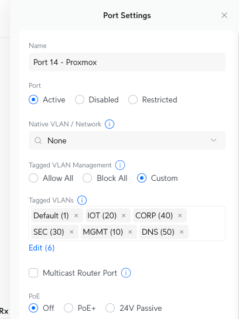
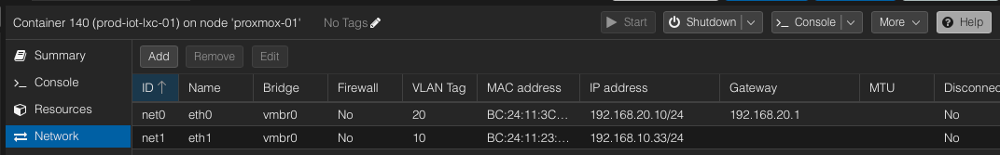

Lessons from the Lab: Multi-VLAN Networking on Proxmox with a UDM Pro

Setting up Proxmox in a multi-VLAN environment sounds straightforward on paper. But when I started configuring my own home lab with a UniFi Dream Machine Pro (UDM Pro) managing the network and several VLANs in play I quickly discovered that getting Proxmox to behave across VLANs is more art than science.

I want to share the key challenges I hit along the way, how I ultimately resolved them, and what others might want to consider before going down the same path.

## The Setup

My goal was to host a Proxmox hypervisor that could:

- Be managed from the main VLAN (VLAN 10 – `192.168.10.0/24`)
- Host services and containers on different VLANs (e.g., IoT on VLAN 50 – `192.168.50.0/24`)
- Use static IPs for consistency and firewall rule management

The UDM Pro was configured with appropriate VLANs, and the switch port connected to the Proxmox host was tagged accordingly.



> *Diagram: Physical and VLAN topology of Proxmox + UDM Pro*

## The Problem

Despite correct-looking VLAN tagging and interfaces defined in `/etc/network/interfaces`, traffic didn’t behave as expected. SSH attempts from one VLAN to another timed out. Containers couldn’t reach the gateway. Some interfaces were just dead.

It came down to a few critical missteps:

- **Untagged traffic confusion**: The host interface wasn’t properly assigned a VLAN, so packets were treated as untagged.
- **Bridge configuration quirks**: Proxmox needs precise mapping of VLAN-tagged interfaces to bridges.
- **Firewall rules**: The UDM Pro was silently blocking inter-VLAN traffic until I created explicit allow rules.

## What Worked

Once I adjusted the Proxmox host’s physical interface (`enp87s0`) to properly support VLANs, and ensured the bridge was aware of its VLANs, everything started falling into place.

Here’s the key section of my working config:

```bash
auto enp87s0
iface enp87s0 inet manual

auto vmbr0
iface vmbr0 inet manual
	bridge-ports enp87s0
	bridge-stp off
	bridge-fd 0
	bridge-vlan-aware yes
	bridge-vids 10 20 30 40 50

# bridge to default VLAN that the device is locatedon
auto vmbr0.10
iface vmbr0.10 inet static
        address 192.168.10.5/24
        gateway 192.168.10.1

# Bridge to services running on the IOT infrastructuer
auto vmbr0.20
iface vmbr0.20 inet static
        address 192.168.20.5/24

# Bridge to DNS services 
auto vmbr0.50
iface vmbr0.50 inet static
        address 192.168.50.5/24
```
The network/interfaces file went through very many changes till I got it right. Suggest strongly to put it under source control so you can see what you've already tried before you lose your mind.

On the UDM Pro side, I added specific firewall rules to allow SSH and ICMP between VLANs but this is only for specific IPs, not wholesale access.

Finally, in proxmox, most of the containers are configured on VLAN 10 with a single bridge reference. Use of firewall rules allows access to DNS running in VLAN 50. However a special case is where there's an IOT related conatainer that needs to be managed on oneinterface (VLAN 10) but needs to be available on the IOT VLAN 20.




## Key Takeaways

- Bridge-vlan-aware is essential on Proxmox when using VLANs — don’t skip it.
- Tag the Proxmox host’s VLAN traffic properly, or expect weird behavior.
- Use static IPs and clear firewall rules for sanity and control.
- Debug with tcpdump and ping across VLANs to see where things break.
- Expect to iterate as VLANs and Proxmox don’t always play nicely out of the box.

## Final Thoughts
Networking in a virtualized environment is always a bit fiddly, especially when you introduce VLANs, firewalls, and self-hosted services. But once it's dialed in, the control and segmentation it gives you is well worth the effort. If you're wrestling with similar issues, hopefully this post saves you a few hours (or days) of hair-pulling.